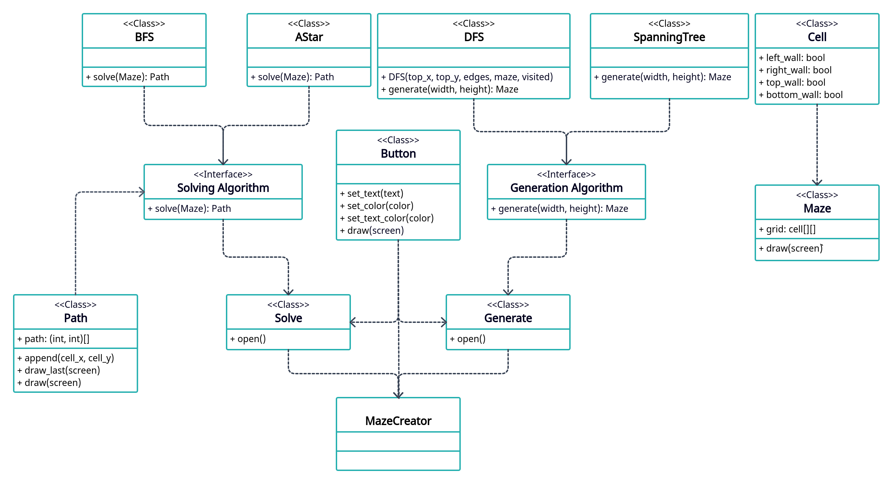

# Python project 1 - Maze builder
Name: [Kirill Zolotuskiy](https://github.com/Kirill-iceland)  
Group: `Б05-327`  

## Description
A program that builds a maze to a specified dimension and allows test it.  

## Uses
- Create mazes with custum dimensions
- Create mazes with different algorithms
- Solve mazes with different algorithms
- Solve mazes yourself

## UML diagram
